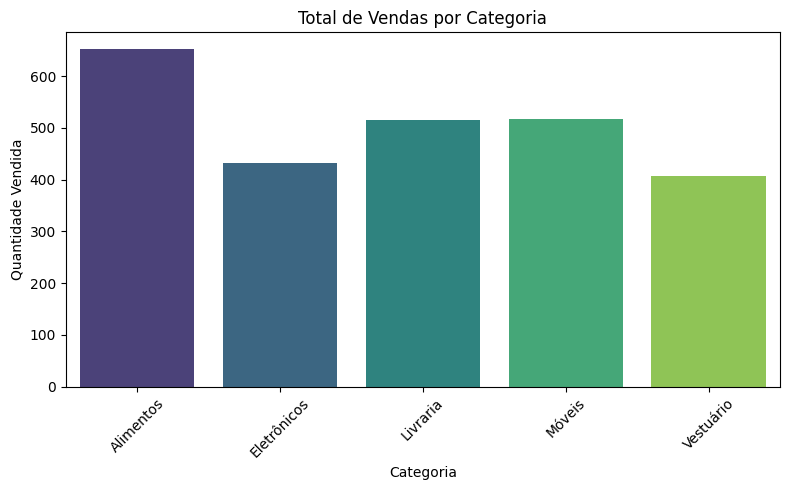
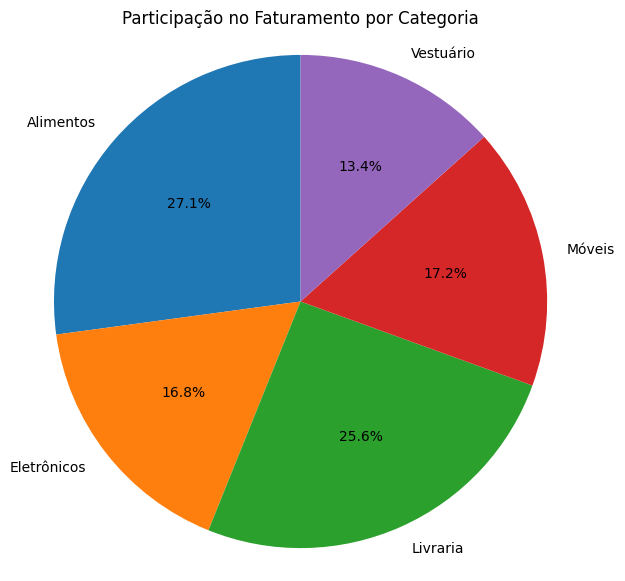
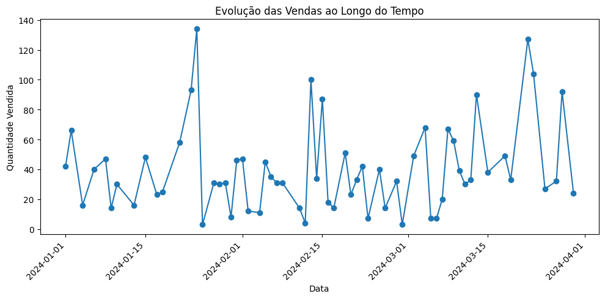

#  Análise de Vendas - Loja Online

Este projeto realiza a análise de um conjunto de dados fictícios de vendas de uma loja online. O objetivo é extrair insights estratégicos por meio de indicadores e visualizações gráficas.

##  Estrutura dos Dados

O arquivo `vendas_online.csv` contém 100 registros com as seguintes colunas:

- `Produto`: Nome do produto vendido  
- `Categoria`: Categoria do produto (Eletrônicos, Vestuário, etc.)  
- `Quantidade`: Quantidade vendida  
- `Preco_Unitario`: Valor unitário do produto  
- `Data_Venda`: Data da venda  

---

##  Indicadores Principais

- **Produto mais vendido**: **Cadeira**
- **Produto menos vendido**: **Tênis**
- **Receita total**: **R$ 3.798.041,45**
- **Média de preço dos produtos vendidos**: **R$ 1.548,12**

---

##  Total de Vendas por Categoria

O gráfico abaixo mostra a quantidade total de vendas por categoria. A categoria **Alimentos** foi a mais vendida, enquanto **Vestuário** teve o menor volume.

---

##  Participação no Faturamento por Categoria

Este gráfico demonstra a participação de cada categoria no faturamento total. Apesar de Alimentos liderar em quantidade, **Livraria** também se destaca com uma boa fatia da receita.

---

##  Evolução das Vendas ao Longo do Tempo

Este gráfico de linha mostra a variação do volume de vendas ao longo dos meses analisados. É possível identificar picos em algumas datas específicas.

---

##  Conclusões

- **Alimentos** têm alta rotatividade e devem ter atenção em estoque e logística.
- **Cadeira** é o destaque em vendas; já o **Tênis** pode ser reposicionado ou promovido.
- Categorias como **Livraria** geram boa receita mesmo com menor volume de vendas.
- Recomenda-se investigar os **picos de venda** para replicar ações promocionais bem-sucedidas.

---

##  Como Reproduzir

1. Clone o repositório
2. Execute o script `gerador_dados_fake.py` para gerar os dados
3. Execute o notebook ou script de análise para visualizar os gráficos
